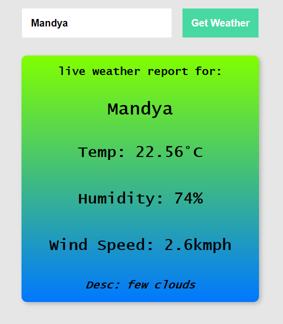

## Weather App — HTML | CSS | JavaScript

a clean and responsive Weather Application that fetches real-time weather updates using a public API.
Built with HTML, CSS, and JavaScript — simple, fast, and beginner-friendly yet portfolio-ready.

## features

-search by city name
-real-time temperature, humidity, wind speed
-location-based weather updates (if implemented)
-fully responsive UI
-handles invalid city errors
-smooth UI & clean component layout

## Tech Stack

1. html5
2. css3
3. javaScript (Vanilla JS)
4. openWeather API (or the API you used)

## preview

# expected/actual output

## Setup & Installation

1. clone the repository 
git clone <https://github.com/satoru1726/weather-application-html-css-js.git>
2. open the project folder
cd weather-app-html-css-javaScript
3. Run the app
Just open index.html with any web browsers 
or 
Use a live server (recommended)

## author info.
**_Jayanth A R_**
 
aspiring Full Stack Dev.
 
mail: <zeninmakisan2025@gmail.com>
 
linkedIn: <www.linkedin.com/in/jayanth-a-r-254232323>

## license info.
this project is open-source and available under the MIT License.
